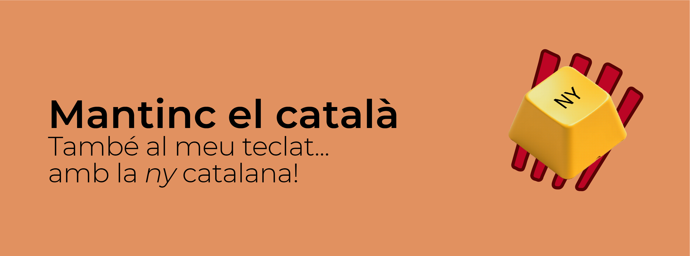

[//]: # (# enya-catalana)
<p align="center">
 <a href="https://github.com/eloicase/ny-catalana" target="_blank">
        </a>
</p>

[**Abstract**](#Abstract)
| [**Historial**](https://github.com/eloicase/enya-catalana#Historial) 
| [**Introducció**](#Introducció)
| [**Instal·lació**](#Instal·lació)
| [**Programari**](https://github.com/eloicase/enya-catalana#Programari)
| [**Maquinari**](https://github.com/eloicase/enya-catalana#Maquinari)
| [**Roadmap**](https://github.com/eloicase/enya-catalana#Roadmap)
| [**Enllaços**](https://github.com/eloicase/enya-catalana#Enllaços)
| [**Comunitat**](https://github.com/eloicase/enya-catalana#Comunitat)
| [**Agraïments**](https://github.com/eloicase/enya-catalana#Agraïments)

<video src='/assets/ny-catalana.mp4' width=180/></video>
---
<a name="Highligts"></a>
## Abstract
El projecte **_NY_ Catalana** vol ser un repositori per centralitzar tots els recursos a fi de personalitzar el teclat QWERTY/llatí en castellà substituint la lletra **_Ñ_** pel dígraf **_NY_**.


<a name="Historial"></a>
## What's New 🔥
- 2025/02: Primera versió del repositori amb versions per a MacOS i Ubuntu Linux/Debian.

<a name="Introduction"></a>
## Introducció

_<div style="margin-left: auto;
            margin-right: auto;
            width: 30%"><p style="text-align: center;"></p>		«El senyor i la senyora Campmany dels Hostalets de Balenyà feia anys i panys que enyoraven un bany a l'estany de la muntanya ja que hi tenien una cabanya feta de llenya, envoltada de  vinyes i senyalitzada amb el senyal d'una pinya amb pinyons i el text "Seny i rauxa", casinyot que van comprar enganyats, tot i que era un bunyol i va costar un ronyó.»</p></div>_

<br>


Els catalanoparlants i "catalanoescrivents" ens hem acostumat a utilitzar _de facto_ el teclat en castellà que inclou una lletra que MAI no farem servir: la _ñ_.
En canvi, en català, el dígraf _ny_ sempre ha estat a l'ombra de la ce trencada i de la ela geminada com a lletres insignes del català, tot i que, en general, es fan servir molt menys que la grafia _ny_. Des d'aquí es vol reivindicar la _ny_ catalana fins i tot en els nostres teclats.

En els dispositius actuals hi ha diferents alternatives per usar diferents configuracions de teclat, ja que els sistemes més utilitzats (Mac, Linux, Windows) permeten canviar fàcilment de teclat a altres idiomes. Però malauradament no tenim una configuració de teclat ISO ni ANSI plenament en català. 
Una solució seria fer servir, per exemple, la configuració de teclat en anglès; tanmateix, a part que ens hem d'aprendre de nou la ubicació de molts símbols i signes de puntuació, es perd la **ç** i el punt volat. La configuració de teclat portuguès té la **_ç_** enlloc de la **_ñ_** però continuem perdent el punt volat de la ela geminada.

Això, més que no pas solucions, són pedaços a mitges i malauradament estem acostumats a saber on són les tecles dels signes de puntuació, dels accents i d'altres símbols que apareixen sobre els números en el teclat en castellà.

És per això que aquest repositori vol ser una solució que aglutini els recursos per assolir els punts següents:

- Utilitzar el teclat plenament en català.
- Desfer-se de la lletra **_ñ_** del teclat i utilitzar el dígraf propi del català: **_ny_**.
- Aconseguir que la resta de tecles del teclat funcionin com hi estem habituats.


Per arreglar la situació s'ha d'afrontar el problema des del punt de vista del programari i del maquinari.

<a name="Instal·lació"></a>
## Instal·lació

### Programari
Es proposa fer servir una configuració de teclat personalitzat que, en prémer la tecla **_Ñ_**, el teclat generi directament **_NY_**.

### Maquinari
Substituir la tecla en qüestió per una que mostri el que realment s'escriu un cop feta la modificació del programari (aplicable bàsicament a teclats mecànics).
En cas que no sigui factible substituir fàcilment la tecla, es proposa, com a pla B, generar adhesius en forma de tecla que es puguin enganxar a sobre de la tecla **_Ñ_**.


<a name="Programari"></a>
## Programari

### Entorn MacOS

- Descarregar el repositori:

``` sh
git clone https://github.com/eloicase/ny-catalana.git

```

- Descomprimir el teclat que es vulgui instal·lar. Tots els teclats substitueixen la **_Ñ_** per la **_NY_** però cadascún amb una icona personalitzada diferent:


| Fitxer             |  Icona |
:-------------------------:|:-------------------------:
Catalan Bandera Negra.zip |  |  
Catalan Estelada.zip |  | 
Catalan Senyera.zip |  | 
Catalan Star Trek Federation.zip |  | 
Catalan Star Trek.zip |  | 
Catalan Star Wars Empire.zip |  | 
Catalan Star Wars Mandalorian.zip |  | 
Catalan Star Wars Rebel.zip |  | 


- Fer doble clic en el teclat customitzat triat per instal·lar:
``` sh
~/Users/username/ny-catalana/MacOS/Catalan Senyera

```

- o copiar-lo manualment a:
``` sh
~/Users/username/Library/Keyboard Layouts
```

- Activar el teclat des de:
``` sh
Preferències del Sistema -> Teclat -> Dispositius d'entrada
```

Un cop activat el teclat, ja es podrà fer servir des del menú Teclats de la barra superior.

> [!Note]
> Es recomana no instal·lar més d'un teclat simultàniament, ja que més d'un teclat personalitzat en català fa que no es mostri la icona correcta. En cas de problemes, cal desinstal·lar els teclats sobrants i reiniciar l'ordinador.

### Entorn Linux Ubuntu/Debian
El procés és un xic més complicat, però si se segueixen els passos és fàcil de dur a terme.

> [!Note]
> S'ha intentat generar un teclat personalitzat a l'estil de MacOS i instal·lar-lo a _/usr/share/X11/xkb/catalan_, però en Linux no permetia configurar dos caràcters en una sola tecla.

La solució que funciona és utilitzar l'aplicació **input-remapper**, que permet configurar les tecles i admet més d'un caràcter per tecla.

- Instal·lar **input-remapper** mitjançant _Ubuntu Software_ o obrir un terminal i descarregar l'aplicació manualment:

``` sh
sudo apt install input-remapper
```
- Obrir l'aplicació i configurar la tecla **_N_** perquè generi **_NY_**. Instruccions de configuració al repositori d'**input-remapper** (https://github.com/sezanzeb/input-remapper).

### Entorn Windows

> [!Note]
> Actualment no es té accés a una màquina Windows i s'entén que hi ha d'haver una solució similar per poder activar configuracions de teclat personalitzades. Aquest repositori queda obert a la comunitat per afegir-hi la versió Windows del teclat customitzat que generi **_NY_** enlloc de **_Ñ_**.

### Entorn iOS

El teclat dels iPhones i iPads és configurable en català, tot i que no es poden configurar fàcilment els teclats perquè es generi el dígraf **_NY_**. 

### Entorn Android

> [!Note]
> Igual que en Windows, no es té accés a un dispositiu Android per desenvolupar la versió corresponent. S'entén que tindrà un funcionament similar a iOS quant als teclats.

### Mutliplataforma

Una altra opció per configurar teclats mecànics independentment del sistema és emprar una solució en línia que configuri els teclats. Però aquí ens trobem amb altres limitacions com, per exemple, els navegadors compatibles, els teclats que es poden configurar i altres consideracions respecte a seguretat, etc.

Una opció és utilitzar **_Via_** (https://www.caniusevia.com), un programari lliure que fa exactament aquesta funció i que es pot fer servir en diferents sistemes i navegadors però també té les seves limitacions. 

Consultar navegadors compatibles a:

https://caniuse.com/?search=webhid

i els teclats compatibles a:

https://www.caniusevia.com/docs/supported_keyboards

Val a dir que també tenen una versió d'escriptori.

### Dependència del fabricant

Alguns fabricants tenen la seva pròpia aplicació per configurar les tecles del teclat com, per exemple, Keychron (https://www.keychron.com), que, mitjançant l'aplicació **_web Launcher_** (https://launcher.keychron.com/#/keymap), permet configurar les tecles. Sembla, però, que l'aplicació és una versió de **_Via_** personalitzada pel fabricant.


<a name="Maquinari"></a>
## Maquinari

### Teclats mecànics

Els teclats mecànics amb _key caps_ intercanviables permeten substituir fàcilment les tecles del teclat.

Es proposen diferents llocs web que per pocs diners produeixen tecles soltes amb la grafia que es vulgui. Els llocs no són afiliats i no s'obté cap guany per esmentar-los. S'han inclòs perquè s'han provat personalment i perquè els següents llocs generen tecles amb un bon resultat:

- https://www.etsy.com/listing/1327161476/create-your-own-custom-text-keycaps-any

- https://www.etsy.com/listing/1376134454/create-your-own-custom-pbt-non-backlit


### Teclats de perfil baix i portàtils

Es poden imprimir les plantilles de _/templates_ en un full autoadhesiu, retallar-les i plastificar-les per posteriorment enganxar-les a sobre de la tecla **_Ñ_**.

S'han desenvolupat diferents _templates_ que s'adapten a teclats de diferents colors i posicions de la lletra.

| Template | Sistema | Tipografia | 
|--|--------------|-----------|
|Apple-ny-catalana-KeyCaps-template-(84-03).pdf|Macintosh (Teclats del 1984 al 2003)|Univers Cond Light Oblique|
|Apple-ny-catalana-KeyCaps-template-(03-15).pdf|Macintosh (Teclats del 2003 al 2015)|VAG Rounded|
|Apple-ny-catalana-KeyCaps-template-(15-25).pdf|Macintosh (Teclats del 2015 al 2025)|San Francisco|
|Generic-ny-catalana-KeyCaps-template-regular.pdf|Teclats genèrics|Helvetica Regular|
|Generic-ny-catalana-KeyCaps-template-light.pdf|Teclats genèrics|Helvetica Light|
|Generic-ny-catalana-KeyCaps-template-italic.pdf|Teclats genèrics|Helvetica Italic|
|Generic-ny-catalana-KeyCaps-template-lightItalic.pdf|Teclats genèrics|Helvetica Light Italic|

<a name="Roadmap"></a>
## Roadmap
|  | Programari (teclat customitzat) | Programari (app de 3rs) | Maquinari | 
|--|--------------|-----------| --------- |
|MacOS|✅|❌|✅|
|Linux Ubuntu/Debian|❌|✅|✅|
|Windows|❌|❌|✅|
|iOS|✅|❌|❌|
|Android|❌|❌|❌|

<a name="Enllaços"></a>
## Enllaços

- Mantinc el català https://mantincelcatala.cat

- Input Remapper https://github.com/sezanzeb/input-remapper
<p align="center">
<a href="https://github.com/sezanzeb/input-remapper" target="_blank">
        </a>
</p>

- Via online https://www.caniusevia.com

- Keychron Launcher https://launcher.keychron.com/#/keymap

- Ephemeral-t-shirts https://ephemeral-t-shirts.blogspot.com/

<a name="Comunitat"></a>
## Comunitat

Aquest repositori queda obert també a afegir-hi altres dispositius/sistemes en que la comunitat consideri que val la pena de mantenir el català, també en els teclats d'aquests dispositius.

<a name="Agraïments"></a>
## Agraïments

- Montserrat Puig, professora de català del Consorci per a la Normalització Lingüística (Centre Nou Barris).
    https://www.cpnl.cat/